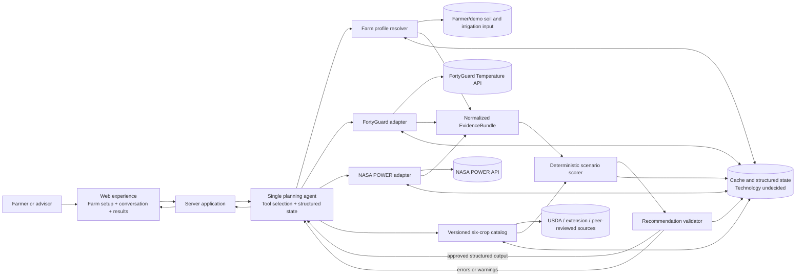
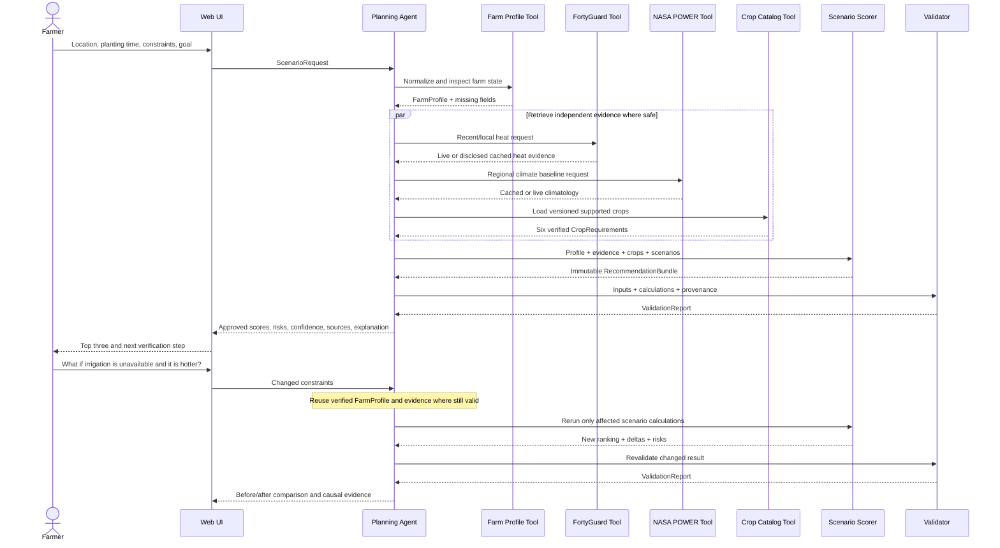

Status: Planned Architecture — implementation has not started yet.

# CropMatch AI - Planned Architecture

## Architecture Overview

CropMatch AI is planned as a small web application built around a **single bounded planning agent** and a **deterministic recommendation engine**. The agent may decide which approved tools and scenarios are needed, but it may not invent crop requirements or freely calculate final scores. Provider data, catalog rules, calculations, validation, and explanation are separate responsibilities.

The intended architecture has five logical bands:

1. **User experience:** Farm setup, conversational requests, user-safe tool activity, crop comparisons, scenario deltas, and evidence details.
2. **Agent/application layer:** Request interpretation, structured farm state, bounded tool planning, scenario construction, and response assembly.
3. **Evidence layer:** FortyGuard, NASA POWER, farmer-supplied fields, a versioned crop catalog, and optional USDA-derived evidence.
4. **Decision layer:** Eligibility filters, crop-specific heat metrics, weighted suitability, risk flags, confidence inputs, and scenario comparisons.
5. **Validation and persistence:** Schema/numerical/grounding checks plus provider cache, structured state, evidence provenance, and recommendation traces.

External requests are intended to run server-side so API and model keys never reach the browser. Provider calls should use timeouts and bounded polling. Slowly changing data and one complete demo evidence bundle should be cached with visible timestamps and fallback labels.

## Architecture Diagram

### Request and Follow-up Sequence

## Component Breakdown

### Web Experience

- **Purpose:** Provide a short, trustworthy farmer decision flow.
- **Responsibilities:** Collect location and planting time; accept soil, drainage, irrigation, and unknown values; send scenario questions; display user-safe tool status; compare the top three crops; expose an evidence drawer.
- **Inputs:** User fields, sample farm selection, natural-language goal/follow-up.
- **Outputs:** Structured requests and rendered validated results.
- **Technology:** Next.js or React is proposed; exact choice is `Status: Undecided`.
- **Dependencies:** Server application and approved response contracts.

### Server Application / API Boundary

- **Purpose:** Protect secrets and create a stable boundary between the browser, agent, providers, and calculations.
- **Responsibilities:** Authentication if later needed, request validation, session state access, provider adapters, timeouts, cache access, tool dispatch, and response serialization.
- **Inputs:** Frontend requests.
- **Outputs:** User-safe progress events and final responses.
- **Technology:** Next.js server routes or FastAPI. `Status: Undecided`.
- **Dependencies:** Agent runtime, typed schemas, cache/storage, provider clients.

### Farm Profile Resolver (`resolve_farm_profile`)

- **Purpose:** Convert user input into trusted, reusable structured state.
- **Responsibilities:** Normalize location and planting time, retain source labels, validate coordinate bounds and enumerated fields, detect missing/conflicting inputs, version changed fields, and calculate profile completeness notes.
- **Inputs:** Location, planting month/time, soil, drainage, irrigation.
- **Outputs:** `FarmProfile`, missing-field list, and confidence notes.
- **Technology:** Pure typed application code.
- **Dependencies:** Optional geocoding/map input; no geocoder was selected.

### Planning Agent

- **Purpose:** Make the autonomous decision workflow visible while remaining bounded.
- **Responsibilities:** Interpret the farmer's goal, inspect state, select only necessary tools, construct supported scenarios, request calculations and validation, and explain approved values without editing them.
- **Inputs:** `ScenarioRequest`, current `FarmProfile`, last structured evidence/recommendation state.
- **Outputs:** Tool plan, tool calls, and final farmer response mapped to sources.
- **Technology:** One structured tool-calling loop; model/provider `Status: Undecided`.
- **Dependencies:** All typed tools and the validator.

### FortyGuard Adapter (`get_fortyguard_heat`)

- **Purpose:** Supply the primary recent/local heat signal and supported short-range operational risk.
- **Responsibilities:** Build valid request payloads; submit asynchronous jobs; poll with a deadline; normalize endpoint-specific schemas; record `activity_id`, time, units, spatial resolution, and live/cache status; provide cached fallback without secrets.
- **Inputs:** Coordinate or small polygon, time window, analysis type, crop thresholds where needed, and forecast horizon.
- **Outputs:** Normalized heat metrics/source records and raw-response references.
- **Technology:** The local Python client is a tested research reference; production adapter language depends on the chosen backend.
- **Dependencies:** FortyGuard API and cache.

### NASA POWER Adapter (`get_nasa_climate`)

- **Purpose:** Supply a long-term regional climate baseline.
- **Responsibilities:** Request point climatology or summarized daily history; normalize selected temperature, precipitation, humidity-related, and solar variables; cache by rounded coordinate, variable set, and climatology period; label coarse resolution.
- **Inputs:** Latitude, longitude, variables, climatology period.
- **Outputs:** Normalized regional baseline and provenance.
- **Technology:** REST adapter in chosen backend.
- **Dependencies:** NASA POWER API and cache.

### Crop Catalog (`get_crop_catalog`)

- **Purpose:** Ground every crop name, threshold, calendar rule, and explanation.
- **Responsibilities:** Store six versioned crop records; validate inverted ranges and missing sources; identify supported region/variety scope; prevent unverified thresholds from hard filtering.
- **Inputs:** Region, crop filters, catalog version.
- **Outputs:** `CropRequirement[]` with source and review metadata.
- **Technology:** Selected initial form is hand-curated JSON; storage may later move to a database.
- **Dependencies:** USDA, university extension, peer-reviewed sources, and optional FAO plausibility checks.

### Scenario Scorer (`score_crop_scenarios`)

- **Purpose:** Produce reproducible eligibility, suitability, risk, and scenario comparisons.
- **Responsibilities:** Apply hard filters, derive crop-specific heat metrics, calculate component scores, use documented weights, handle missing data under an explicit policy, create risk flags, and return before/after deltas.
- **Inputs:** `FarmProfile`, `EvidenceBundle`, `CropRequirement[]`, and scenario assumptions.
- **Outputs:** `RecommendationBundle` containing crop IDs, eligibility, filter reasons, scores, factor scores, heat metrics, risk flags, confidence inputs, deltas, and calculation version.
- **Technology:** Pure deterministic functions.
- **Dependencies:** Versioned calculation policy and normalized evidence.

### Recommendation Validator (`validate_recommendation`)

- **Purpose:** Block numerically inconsistent, ungrounded, incomplete, or unsafe results.
- **Responsibilities:** Validate schemas, reconcile totals, verify crop IDs and thresholds, check evidence coverage/freshness, confirm the explanation preserves scorer values, and decide whether rendering is allowed.
- **Inputs:** All normalized inputs and calculated outputs.
- **Outputs:** `ValidationReport` with errors, warnings, confidence, grounding status, and `render_allowed`.
- **Technology:** Deterministic typed validation.
- **Dependencies:** Catalog version and calculation contract.

### Storage and Cache

- **Purpose:** Make results reproducible, provider-efficient, and resilient.
- **Responsibilities:** Persist or reference farm versions, evidence records, raw responses, cache metadata, catalog versions, scenario assumptions, recommendation bundles, validation reports, and user-safe tool traces.
- **Inputs/outputs:** Structured entities listed below.
- **Technology:** JSON plus SQLite or simple Postgres were proposed. `Status: Undecided`.
- **Dependencies:** Server application and provider adapters.

## Core Data Contracts

| Entity | Essential planned fields |
|---|---|
| `FarmProfile` | `id`, coordinate, planting time, soil, drainage, irrigation, source labels, missing fields, version |
| `EvidenceRecord` | provider, original field, normalized value, unit, coordinate/area, time range, spatial resolution, `fetched_at`, cache status, raw-response reference |
| `EvidenceBundle` | provider records, normalized variables, time range, resolution, freshness, cache/live state |
| `CropRequirement` | versioned identity, thermal/stage, soil, water, calendar, variety/region, evidence fields |
| `ScenarioRequest` | base profile version, changed variables, scenario label, assumption disclosure |
| `RecommendationBundle` | eligibility, scores, factors, heat metrics, risks, deltas, confidence inputs, calculation version |
| `ValidationReport` | errors, warnings, confidence, grounding status, `render_allowed` |
| `AgentTrace` | tool name, arguments summary, start/end state, live/cache status, user-safe summary |

Previous free-text model output must not be stored as trusted application state.

## Detailed Data Flow

1. **Request validation:** Confirm a US coordinate or valid small polygon, planting time, bounded crop region, and allowed soil/irrigation values.
2. **Profile resolution:** Normalize values, preserve source labels, identify unknowns, and create/reuse a profile version.
3. **Bounded planning:** The agent creates a list of approved tools and structured arguments. Hidden chain-of-thought is neither required nor displayed.
4. **Evidence retrieval:** Independent provider calls may run in parallel where safe. FortyGuard uses submit/poll; NASA POWER is a synchronous point request. Both may read from cache under policy.
5. **Provenance normalization:** Every value receives provider, original field, normalized unit/value, coordinate/area, time range, resolution, fetch time, and cache status.
6. **Catalog load:** The selected catalog version and its six crop IDs are loaded.
7. **Heat feature generation:** Relevant observations are compared with each crop's sourced preferred band and extreme threshold; exposure duration, anomaly, stage overlap, and short-horizon event flags are calculated where supported.
8. **Eligibility:** Unsupported planting months, impossible growing-season requirements, or documented incompatible constraints remove or cap crops according to policy.
9. **Suitability:** Eligible crops receive component scores and a reproducible total. Missing values are not treated as matches.
10. **Risk and confidence:** Hazards and uncertainty remain separate from suitability. Missing soil, stale cache, coarse spatial fit, weak variety specificity, and partial provider responses lower confidence.
11. **Validation:** Schemas, calculations, source grounding, and rendering safety are checked.
12. **Explanation:** The agent receives only approved structured output and produces plain-language reasons, risks, sources, and next actions without changing numbers.
13. **Follow-up:** Changed constraints create a new `ScenarioRequest`; still-valid evidence and the verified profile are reused, affected calculations are rerun, and deltas are validated.

## FortyGuard Integration

FortyGuard sits in the evidence layer behind a server-only adapter. It is called before any heat-based recommendation unless a clearly labeled cached response is used. The planned adapter submits a polygon heatmap request, receives an `activity_id`, polls `GET /v1/status/{activity_id}` with a deadline, and normalizes the result.

The most relevant planned uses are:

- `tcm` heatmap values for recent/local temperature context.
- `exceedance` and `persistence` heatmaps for hours above crop-specific thresholds and longest continuous exposure.
- `time_of_measure` where time-of-peak is useful.
- Up-to-12-hour heatmap forecasting where supported, used only as an operational event flag.
- Environmental parameters only if they add validated value and plan access permits; the fixed-temperature heat-index behavior requires caution.

Satellite, street-view, and heat-intelligence endpoints were researched through the quickstart but are not selected for the CropMatch MVP. They are premium and would distract from the crop decision loop.

See [API_NOTES.md](./API_NOTES.md) for endpoints, payloads, schemas, limits, and documentation conflicts.

## Dataset Integration

- **NASA POWER:** Planned dynamic point request with normalized JSON cached by rounded coordinate/variables/period. It supplies a coarse long-term baseline, not field truth.
- **Crop catalog:** Planned prebuilt six-record JSON bundle with source URLs and review metadata.
- **Farmer/demo soil profile:** Planned direct form input with one manually verified demo profile; automated SSURGO is deferred.
- **USDA NASS:** Optional pre-cached county summary only if the core workflow is complete.
- **FAO/global suitability sources:** Secondary plausibility or post-hackathon validation references, not runtime dependencies.

Evidence is expected to combine by farm coordinate/area and aligned time/season context. The exact baseline period, crop list, region, missing-data policy, and growth-stage alignment remain unresolved. See [DATASETS.md](./DATASETS.md).

## Backend / Frontend / Analytics Interaction

The frontend should send structured requests to the server and receive progress states plus a final validated result. It must not call FortyGuard or the model directly. The server owns provider credentials, session state, orchestration, calculation, validation, and cache access.

The analytics boundary is strict:

- The agent chooses **what** approved calculation to request.
- Deterministic functions calculate **the number**.
- The validator determines whether the result can be shown.
- The agent explains the unchanged result.

Progress events may name tools and live/cached state, but must not expose hidden chain-of-thought or secrets.

## Storage Strategy

`Status: Undecided`

The latest plan proposes JSON plus SQLite or simple Postgres. The minimum viable strategy is:

- Hand-curated, versioned crop JSON.
- Cache NASA climatology by rounded coordinate, variables, and period.
- Cache FortyGuard by coordinate/polygon, time range, endpoint, analysis parameters, and `activity_id`.
- Preserve one complete secret-free demo `EvidenceBundle` with original timestamps and a visible cached-data label.
- Persist structured farm/recommendation/validation state only if needed for the follow-up experience.
- Avoid retaining unnecessary farmer-identifying data.

Whether all of this remains local JSON or uses SQLite/Postgres must be decided after the application/backend choice.

## Deployment Concept

`Status: Undecided`

The proposed target is Vercel or an equivalent public host with server-side environment variables. If a separate FastAPI backend is selected, it will need its own managed deployment. Required deployment behavior includes a stable public URL, request timeouts, bounded polling, cached fallback, mobile-capable layout, and no secrets in client bundles or logs.

No deployment has been created.

## Architecture Decisions

1. **Single agent, not multi-agent:** Easier to demonstrate state, planning, adaptation, and correctness within one week.
2. **Tool-driven architecture:** Makes provider calls and calculations visible and testable.
3. **Deterministic scoring boundary:** Prevents the language model from inventing or modifying scores.
4. **Separate validator:** Allows rendering to fail safely when grounding or reconciliation fails.
5. **Structured state:** Reuse `FarmProfile` and evidence bundles, never prior prose as truth.
6. **Provider abstraction and caching:** Supports reproducibility and a disclosed demo fallback.
7. **Small catalog:** Six sourced records are more credible than hundreds of unverified crops.
8. **Scenario engine, not seasonal forecaster:** Keeps future conditions explicitly counterfactual.
9. **Suitability, risk, and confidence are separate:** Avoids hiding hazards or uncertainty inside one score.

## Technical Risks

- FortyGuard rural coverage or plausibility may fail for the chosen farm.
- Current official FortyGuard documentation and the local quickstart disagree on date coverage, filter types, heat-intelligence retrieval, and one stale unit docstring. Live tests are required.
- The API is asynchronous and may have eventual-consistency 404s immediately after submission.
- Provider latency or failure could break a public demo without a complete cache path.
- NASA POWER resolution is too coarse for field-level claims.
- Crop thresholds may not generalize across varieties, regions, and management.
- Sensitive-stage timing may be inaccurate without a clear GDD/calendar method.
- Missing-data renormalization is not fully specified.
- An LLM could paraphrase numbers incorrectly unless response rendering is schema-bound.
- Choosing a separate Python backend may increase deployment complexity.
- Catalog curation and evaluation can consume more of the sprint than expected.
