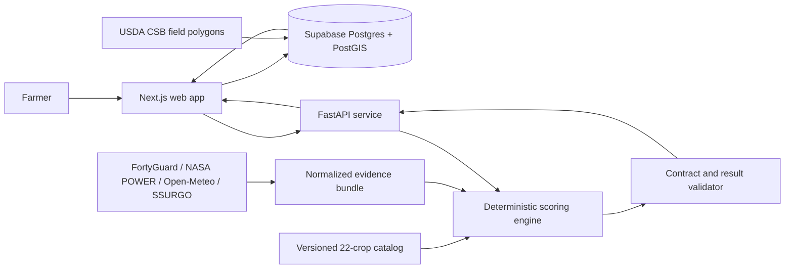

# CropSage

CropSage helps Texas farmers choose suitable crops using trusted climate, weather, and soil data with transparent scoring.

[Live demo](https://frontend-production-edcb.up.railway.app/farm)

## Overview

CropSage is a pre-planting crop suitability decision-support application for Texas. A farmer selects or draws a field, chooses a crop and planting month, and supplies any known water or soil information. CropSage combines that farm profile with normalized location evidence and compares it against a versioned catalog of 22 Texas crops.

The recommendation engine is deterministic: identical validated inputs produce the same scores and ranking. AI may help with conversation and plain-language explanation, but it does not create or modify crop scores, thresholds, or ranks.

CropSage provides preliminary suitability guidance. It is not a yield guarantee, planting instruction, irrigation prescription, legal boundary service, or replacement for a soil test and local agronomic advice.

## What It Does

- Select an official USDA crop-field polygon, place a map pin, or draw a farm boundary manually.
- Collect a planting month, requested crop, irrigation availability, and optional farmer observations.
- Compare all 22 catalog crops using regional, timing, temperature, soil, drainage, water, and irrigation factors.
- Keep suitability and confidence separate so missing evidence is never treated as a favorable match.
- Show ranked results, factor-level reasons, evidence provenance, limitations, and detailed crop information.
- Preserve farm-profile versions, provider evidence, recommendation runs, crop results, and validation reports in Supabase.
- Support controlled scenario comparisons without presenting them as seasonal forecasts.

## Evidence Sources

| Source | Role in CropSage |
|---|---|
| FortyGuard Temperature API | Local heat and temperature-window evidence used in crop temperature comparisons and heat-risk context. |
| NASA POWER | Long-term regional climate and historical weather baseline. Its coarse resolution is disclosed and is not presented as field-level truth. |
| Open-Meteo | Current, recent, and short-term forecast weather plus modeled soil temperature and soil moisture context. |
| USDA SSURGO Soil Data Access | Mapped soil texture, pH, drainage, root-limiting depth, and available-water-capacity evidence. |
| USDA NASS Crop Sequence Boundaries | Synthetic agricultural field polygons for map selection. These are not legal property or ownership boundaries. |

Farmer-supplied soil tests, irrigation details, recent rainfall, and field observations remain explicitly labeled as farmer evidence and do not silently overwrite mapped evidence.

## Supported Crops

Catalog version `1.1.0` contains 22 provisional crop records:

| | | |
|---|---|---|
| Upland cotton | Corn grown for grain | Hard red winter wheat |
| Grain sorghum | Runner-type peanut | Long-grain rice |
| Soybean | Grain oats | Oilseed sunflower |
| Sesame | Corn grown for silage | Forage sorghum |
| Sorghum-sudangrass | Alfalfa grown for hay | Bermudagrass grown for hay |
| Annual ryegrass grown for forage | White potato | Sweet potato |
| Seedless watermelon | Dry-bulb onion | Fresh-market cabbage |
| Fresh-market spinach | | |

Each record includes Texas regional support, planting windows, maturity duration, temperature requirements, soil preferences, pH, root-zone depth, drainage, water demand, drought tolerance, irrigation requirements, references, and evidence-quality metadata.

## Architecture



### End-to-End Flow

1. The browser submits a structured farm profile through the Next.js server.
2. Supabase stores an immutable profile version and creates an assessment session.
3. Location evidence is normalized into a versioned `EvidenceBundle` with provider, time, unit, resolution, freshness, and derivation metadata.
4. The Next.js server sends the farm profile, evidence bundle, and frozen scoring configuration to FastAPI.
5. The Python engine evaluates all 22 crops and returns factor scores, availability, confidence, reasons, limitations, and ranks.
6. Schema and policy validators decide whether the result is safe to render.
7. Supabase stores the recommendation run, per-crop results, factors, evidence links, and validation report.
8. The frontend displays only validated results.

## Technology

- **Frontend:** Next.js 16, React 19, TypeScript, Zod
- **Maps:** MapLibre GL, Terra Draw, Turf, OpenStreetMap, optional MapTiler satellite imagery
- **Backend:** Python 3.11, FastAPI, Pydantic, JSON Schema
- **Scoring:** Versioned deterministic Python engine
- **Database:** Supabase Postgres, PostGIS, Row Level Security, Supabase SSR
- **Deployment:** Railway with separate frontend and backend Docker images
- **Testing:** Vitest, Node test runner, Python `unittest`, Supabase pgTAP/database tests

## Repository Layout

```text
CropSage/
|-- api/                    FastAPI routes and HTTP contracts
|-- apps/web/               Next.js farmer workflow and result interfaces
|-- data/                   Catalog, schemas, evidence, regions, and fixtures
|-- providers/              FortyGuard, NASA POWER, Open-Meteo, and SSURGO adapters
|-- scoring/                Deterministic scoring and recommendation validation
|-- services/               Recommendation orchestration and location resolution
|-- supabase/migrations/    Database schema, policies, RPCs, and hardening
|-- scripts/                Evidence generation, imports, benchmarks, and local tooling
|-- tests/                  Python integration and contract tests
|-- docs/                   Planning, data, API, database, and pipeline documentation
`-- handoff/                Frozen engine fixtures and cross-team contracts
```

## Local Development

### Prerequisites

- Node.js 22 or newer
- npm
- Python 3.11 or newer
- Docker Desktop or another Docker-compatible runtime for local Supabase

The Supabase CLI is installed as a project dependency, so a separate global installation is not required.

### 1. Install Dependencies

```powershell
npm ci

python -m venv .venv
.\.venv\Scripts\Activate.ps1
python -m pip install -r requirements.txt
```

### 2. Configure the Frontend

```powershell
Copy-Item apps\web\.env.example apps\web\.env.local
```

Set the following value in `apps/web/.env.local`:

```dotenv
SCORING_API_URL=http://127.0.0.1:8000
```

`npm run web:dev:local` injects the running local Supabase URL and keys automatically. `NEXT_PUBLIC_MAPTILER_KEY` is optional; without it, the map uses the OpenStreetMap basemap and satellite mode is unavailable.

### 3. Start and Seed Supabase

```powershell
npm run db:start
npm run db:reset
npm run db:csb:demo
```

The demo import loads a bounded official USDA CSB sample near Plainview, Texas. Manual field drawing and point selection work outside this loaded sample.

### 4. Start the Python API

In a second terminal:

```powershell
.\.venv\Scripts\Activate.ps1
python -m uvicorn api.main:app --host 0.0.0.0 --port 8000
```

The deterministic recommendation endpoints work without an LLM key. Set the variables from `.env.backend.example` only when testing live FortyGuard collection or the optional language layer.

### 5. Start the Web App

In a third terminal:

```powershell
npm run web:dev:local
```

Open [http://localhost:3000/farm](http://localhost:3000/farm). The API health endpoint is available at [http://localhost:8000/health](http://localhost:8000/health), and Supabase Studio is available at [http://localhost:54323](http://localhost:54323).

## Environment Variables

| Variable | Service | Required | Purpose |
|---|---|---:|---|
| `NEXT_PUBLIC_SUPABASE_URL` | Frontend | Yes | Supabase project URL exposed to the browser. |
| `NEXT_PUBLIC_SUPABASE_PUBLISHABLE_KEY` | Frontend | Yes | Browser-safe Supabase publishable key. |
| `SUPABASE_SECRET_KEY` | Frontend server | Yes | Server-only database access. Never expose it through a `NEXT_PUBLIC_` variable. |
| `SCORING_API_URL` | Frontend server | Yes | Base URL of the private FastAPI scoring service. |
| `NEXT_PUBLIC_MAPTILER_KEY` | Frontend | No | Enables satellite basemap tiles. |
| `FORTYGUARD_API_KEY` | Backend/tooling | For live collection | Authenticates FortyGuard Temperature API requests. |
| `FORTYGUARD_BASE_URL` | Backend/tooling | For live collection | FortyGuard API base URL. |
| `OPEN_ROUTER_API_KEY` | Backend | No | Primary optional language-provider credential. |
| `GEMINI_API_KEY` | Backend | No | Optional language-provider fallback. |

Contract and engine versions have defaults in `.env.backend.example` and should remain aligned with the checked-in schemas and catalog.

## API

| Method | Endpoint | Purpose |
|---|---|---|
| `GET` | `/health` | Service and contract-version health check. |
| `POST` | `/v1/recommendations/score` | Validate finalized inputs and deterministically score all 22 crops. |
| `POST` | `/v1/recommendations/execute` | Prepare evidence and execute the recommendation workflow. |
| `POST` | `/v1/recommendations` | Request a recommendation from normalized farm inputs. |
| `POST` | `/v1/planting-guidance` | Return crop and location planting guidance. |
| `POST` | `/v1/chat` | Explain validated results through the optional language layer. |
| `DELETE` | `/v1/chat/{session_id}` | Clear process-local demo conversation state. |

The authoritative scoring contract contains `farm_profile`, `evidence_bundle`, and `scoring_config`. Unvalidated evidence is rejected and cannot produce displayable rankings.

## Validation and Tests

```powershell
# Frontend
npm run web:lint
npm run web:test
npm run web:build

# Python API, providers, contracts, scoring, and scenarios
python -m unittest discover -s tests -p "test_*.py"

# Database and import pipeline; local Supabase must be running
npm run db:lint
npm run db:test
npm run db:csb:test
```

## Current MVP Limits

- Crop recommendations currently target Texas and a catalog of 22 crops.
- USDA mapped-field coverage is loaded in bounded packs; the included Plainview sample is partial, not statewide coverage.
- Manual drawing and point selection are available throughout Texas.
- Frost-free-season comparison remains unavailable and is excluded or reported as unknown.
- Numeric heat thresholds, exposure duration, and seasonal water ranges remain supplementary where the catalog lacks transferable evidence.
- All crop records remain `provisional` pending external agronomic review.
- SSURGO values are mapped survey estimates, not exact field measurements or laboratory results.
- Open-Meteo soil moisture is modeled context, not an in-field sensor reading.
- Recommendations do not predict yield, profitability, exact irrigation volume, pests, or disease.

## Data and Safety Rules

- Missing evidence means unknown, never zero or compatible.
- Provider observations are not copied into crop-requirement fields.
- Suitability, risk, and confidence remain separate concepts.
- The LLM cannot calculate or change deterministic results.
- Completed profiles, evidence bundles, recommendation runs, and validation reports are versioned for reconstruction.
- API keys, authorization headers, temporary signed URLs, unsanitized payloads, and hidden reasoning must never be stored.

## Documentation

- [Project context](docs/Project%20context/PROJECT_CONTEXT.md)
- [Architecture](docs/Project%20context/ARCHITECTURE.md)
- [API notes](docs/Project%20context/API_NOTES.md)
- [Datasets](docs/Project%20context/DATASETS.md)
- [Catalog evidence usage policy](docs/CATALOG_EVIDENCE_USAGE_POLICY.md)
- [USDA field-boundary pipeline](docs/USDA_CSB_BOUNDARY_PIPELINE.md)
- [Backend API](api/README.md)
- [Scoring contract handoff](handoff/fatima_scoring_migrations/README.md)

## AI Use Disclosure

OpenAI Codex was used for research, architecture planning, implementation, UI development, debugging, testing, and documentation. The optional application language layer may ask follow-up questions and explain validated outputs. Crop suitability scores and ranks are produced only by the deterministic engine.
